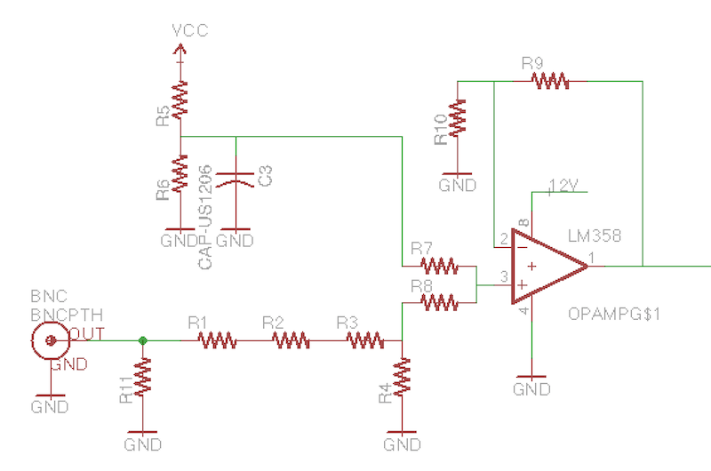

# avr-oscilloscope

Pushing the ATMega328 to its limit: A 150 ksps oscilloscope with edge triggering written in AVR C.

[circuit board](board.jpg)

[Watch Video](https://vimeo.com/80199995)

## ADC
The ADC is configured to operate in free running mode, which means it samples continuously and calls an interrupt when each new sample is ready, which is once every 13.5 ADC clock cycles. The top ADC clock speed for 8-bit resolution is 4MHz, a prescaler of 4 with a 16MHz processor clock. Here is the code that configures the ADC and then functions to start and stop it.

```c
void init_adc()
{
    cbi(ADCSRA, ADEN); // disable adc
    cbi(ADCSRA, ADSC); // stop conversion

    cbi(ADMUX, REFS1); // choose AVcc with external cap
    sbi(ADMUX, REFS0); // for adc voltage reference
    sbi(ADMUX, ADLAR); // left adjust adc readings for 8 bit
    ADMUX |= ( 0 & 0x07 ); // choose analog 0 pin

    sbi(ADCSRA, ADATE); // enable auto trigger of adc
    sbi(ADCSRA, ADIE); // enable adc interrupt

    cbi(ADCSRA, ADPS2); // set prescaler to 4
    sbi(ADCSRA, ADPS1); //
    cbi(ADCSRA, ADPS0); //

    cbi(ADCSRB, ACME); // choose AIN1 for comparator

    cbi(ADCSRB, ADTS2); // choose free running mode
    cbi(ADCSRB, ADTS1); // for auto trigger adc
    cbi(ADCSRB, ADTS0);
}

void start_adc()
{
    sbi( ADCSRA, ADEN );
    sbi( ADCSRA, ADSC );
}

void stop_adc()
{
    cbi( ADCSRA, ADEN );
    cbi( ADCSRA, ADSC );
}
```

## Comparator

The comparator is configured without an interrupt because the comparator's value is read in the ADC interrupt.

```c
void init_comparator(void)
{
    cbi( ACSR, ACD ); // turn on comparator
    cbi( ACSR, ACBG ); // choose digital pin 7 for comparator
    cbi( ACSR, ACIE ); // disable interrupt

    cbi( ACSR, ACIC ); // disable input capture interrupt
}
```

## ADC Interrupt

The ADC interrupt implements a circular buffer of 1024 8-bit samples. At each interrupt it checks if the comparator has detected the input voltage above the trigger level eight consecutive times, a simple noise filter, then sets the stop_index which the interrupt will freeze itself at when it hits it, which is the current index plus half the buffer length, so that the trigger event is always at the center of the circular buffer.

```c
ISR(ADC_vect)
{
    adc_data[adc_counter] = ADCH; // read adc
    if (freeze) {
        freeze = false;
        stop_index = -1;
    } else if (adc_counter == stop_index) {
        freeze = true;
    } else if ( comp == 0 && (ACSR & (1 << ACO)) && stop_index < 0) {
        stop_index = ((adc_counter + (ADC_BUFFER_SIZE >> 1) ) & 0x03FF);
    }
    adc_counter = (( adc_counter + 1 ) & 0x03FF); // increment adc counter
    comp = (comp << 1); // push next comparator value
    comp += (ACSR & (1 << ACO));
}
```

## Trigger Level DAC

The ATMega328 does not have a DAC built-in to set the trigger level, but you can cheat by using PWM with a low-pass filter. For PWM frequency 490 Hz, I used a 100 kΩ resistor and 1 uF capacitor you can get reasonable delay and ripple in the mV range. Below is the code to use PWM on PD3. After this setup function the duty cycle can be changed by modifying the OCR2B register.

```c
void init_pwm()
{
    setOutput(DDRD, PORTD3);
    sbi(TCCR2A, COM2B1);
    sbi(TCCR2A, WGM20);
    sbi(TCCR2B, CS22);
    OCR2B = 128;
}
```

## UART

The UART is configured for 115200 baud. Here's the code to initialize it and then functions to send and receive characters.

```
#define BAUD 115200
#include <util/setbaud.h>

void uart_init() {
    UBRR0H = UBRRH_VALUE;
    UBRR0L = UBRRL_VALUE;

#if USE_2X
    UCSR0A |= _BV(U2X0);
#else
    UCSR0A &= ~(_BV(U2X0));
#endif

    UCSR0C = _BV(UCSZ01) | _BV(UCSZ00); // 8 bit
    UCSR0B = _BV(RXEN0) | _BV(TXEN0); // enable rx and tx
}

void uart_putchar(char c) {
    loop_until_bit_is_set(UCSR0A, UDRE0); // wait until reg empty
    UDR0 = c;
}

char uart_getchar() {
    loop_until_bit_is_set(UCSR0A, RXC0); // wait for byte
    return UDR0;
}
```

## Signal Conditioning

Below is the input signal conditioning circuit. The ADC operates from 0V to 5V, so the circuit uses an op-amp to scale and offset an incoming signal from -10V to 10V to 0V to 5V. It does this with a divide by four voltage divider and then a voltage adder with a 2.5V input from a voltage divider. All resistors in the schematic are 10kΩ except for R11 with is 1 MΩ to make the scope appear as a high impedence to whatever circuit it is measuring.


